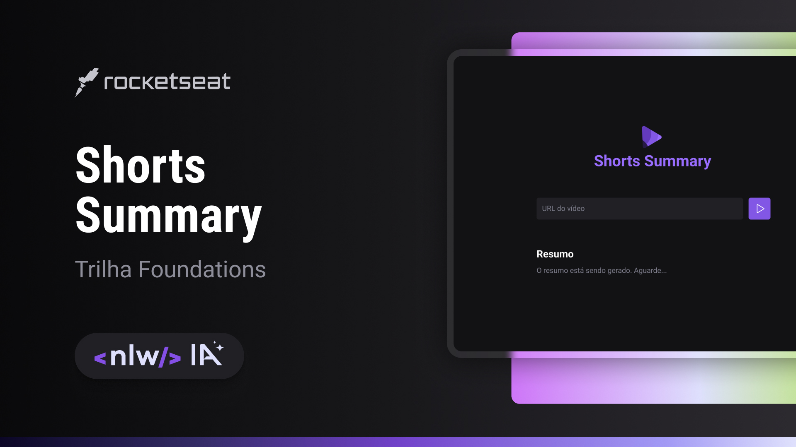

<h1 align="center"> ShortsSummary </h1>

Shorts Summary é uma aplicação web desenvolvida para criar resumos de vídeos shorts do YouTube, utilizando Inteligência Artificial para transcrever o conteúdo do vídeo e descrevê-lo de forma abreviada.

  <a href="#-tecnologias">Tecnologias</a>&nbsp;&nbsp;&nbsp;|&nbsp;&nbsp;&nbsp;
  <a href="#-projeto">Projeto</a>&nbsp;&nbsp;&nbsp;|&nbsp;&nbsp;&nbsp;
  <a href="#-recursos principais">Recursos principais</a>&nbsp;&nbsp;&nbsp;|&nbsp;&nbsp;&nbsp;	
  <a href="#-layout">Layout</a>&nbsp;&nbsp;&nbsp;|&nbsp;&nbsp;&nbsp;
  <a href="#memo-licença">Licença</a>

  

 

  

## 🚀 Tecnologias

Esse projeto foi desenvolvido com as seguintes tecnologias:

- Front-end:
  - HTML
  - CSS
  - JavaScript
- Back-end:
  - Javascript
  - NodeJs
- Inteligência Artificial:
  - Whisper IA
  - Bard IA
- Git e Github
- Figma

## 💻 Projeto

O Shorts Summary é uma aplicação web que combina front e back-end com Inteligência Artificial para criar resumos de videos curtos do Youtube de forma rápida e eficaz, transcrevendo o conteúdo dos vídeos e descrevendo-os de forma resumida.   
Para utilizá-lo, basta copiar o link do vídeo do Youtube Shorts de sua preferência, colar na barra de pesquisa do Shorts Summary, e clicar no botão " ► "   
Este projeto foi desenvolvido na trilha Foundations, edição NLW IA da Rocketseat

## 💻 Recursos Principais

- Resumos automáticos: A aplicação utiliza IA para criar resumos automáticos de vídeos curtos do YouTube em formato de texto.
- Interface intuitiva: A interface de fácil usabilidade permite que você insira o link do vídeo e visualize o resumo gerado em segundos.
- Integração com a API do YouTube: A aplicação se conecta à API do YouTube para acessar informações detalhadas sobre os vídeos.

## 🔖 Layout

Você pode visualizar o layout do projeto através [DESSE LINK](https://www.figma.com/community/file/1282823495335498952). É necessário ter conta no [Figma](https://figma.com) para acessá-lo.

## :memo: Licença

Esse projeto está sob a licença MIT.

---

Feito com ♥ por Bernardo Sá :wave: [Participe da comunidade da Rocketseat!](https://discord.gg/rocketseat)
